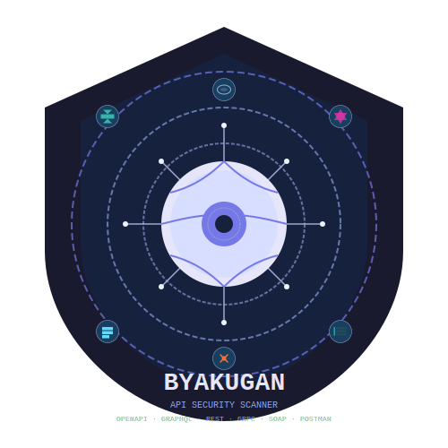

# By4kug4n - API Security Scanner | Công cụ quét bảo mật API

  

  
  
  
  

By4kug4n is a modern API security scanning tool developed with Python and Go, supporting various API formats and vulnerability detection strategies.

By4kug4n là một công cụ quét lỗ hổng API hiện đại được phát triển với Python và Go, hỗ trợ đa dạng các định dạng API và chiến lược phát hiện lỗ hổng.

## Key Features | Tính năng chính

- **Multi-format API Support | Hỗ trợ đa định dạng API**
  - OpenAPI/Swagger (2.0, 3.0, 3.1)
  - Postman Collections
  - GraphQL
  - SOAP/WSDL

- **Powerful Scanning Engine | Engine quét mạnh mẽ**
  - Concurrent endpoint scanning | Quét đồng thời nhiều endpoints
  - Automatic injection point detection | Tự động phát hiện injection points
  - Smart rate limiting and retry | Rate limiting và retry thông minh
  - Optimized worker pool | Worker pool tối ưu
  - Built-in proxy rotation | Proxy rotation tích hợp

- **Flexible Rule Engine | Rule Engine linh hoạt**
  - Rule-based scanning
  - Custom rule development
  - Rule profiles (OWASP API Top 10, PCI-DSS)
  - Plugin architecture

- **Diverse Authentication | Xác thực đa dạng**
  - OAuth 2.0 (all flows | tất cả flows)
  - JWT
  - API Keys
  - Basic Auth
  - Custom auth methods

- **Detailed Reporting | Báo cáo chi tiết**
  - JSON/CSV exports

## Installation | Cài đặt

### Requirements | Yêu cầu

- Python 3.9+
- Go 1.18+
- Docker (optional | tùy chọn)

### Source Installation | Cài đặt từ source

...

## Contributing | Đóng góp

See [CONTRIBUTING.md](CONTRIBUTING.md) for details on how to contribute.

Xem [CONTRIBUTING.md](CONTRIBUTING.md) để biết thêm chi tiết về cách đóng góp.

## License | Giấy phép

This project is released under the [MIT License](LICENSE).

Project được phát hành dưới [MIT License](LICENSE).