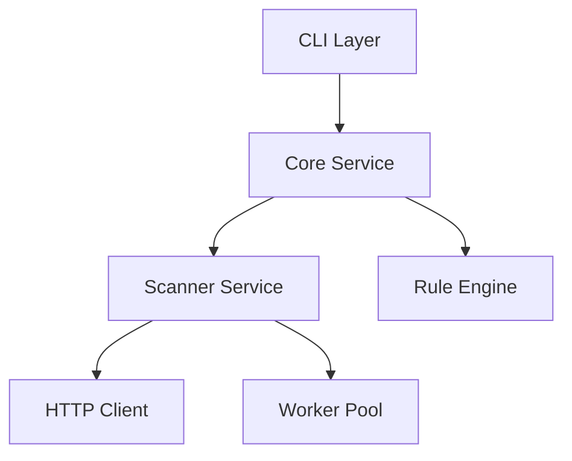

# Byakugan - Advanced API Security Scanner | Công cụ Quét Bảo Mật API

<p align="center">
  
</p>

<p align="center">
  
  
  
  
</p>

## Overview | Tổng Quan

Byakugan is an open-source API security scanning tool designed for both real-world application testing and educational purposes. Built with Python and Go, it provides comprehensive API security testing capabilities while maintaining an architecture suitable for academic study and research.

Byakugan là một công cụ quét bảo mật API mã nguồn mở được thiết kế cho cả mục đích kiểm thử thực tế và giáo dục. Được xây dựng bằng Python và Go, công cụ cung cấp khả năng kiểm tra bảo mật API toàn diện đồng thời duy trì kiến trúc phù hợp cho việc nghiên cứu và học tập.

## Architecture | Kiến Trúc



## Key Features | Tính Năng Chính

### Multi-format API Support | Hỗ Trợ Đa Định Dạng API
- OpenAPI/Swagger (2.0, 3.0, 3.1)
- Postman Collections
- GraphQL
- SOAP/WSDL
- Custom API definitions | Định nghĩa API tùy chỉnh

### Advanced Scanning Engine | Engine Quét Nâng Cao
- Concurrent endpoint scanning | Quét đồng thời nhiều endpoints
- Smart parameter fuzzing | Fuzzing tham số thông minh
- Automated vulnerability detection | Phát hiện lỗ hổng tự động
- Custom attack pattern support | Hỗ trợ mẫu tấn công tùy chỉnh
- Rate limiting and retry mechanisms | Cơ chế giới hạn tốc độ và thử lại

### Flexible Rule Engine | Rule Engine Linh Hoạt
- YAML-based rule definitions | Định nghĩa rule dựa trên YAML
- Plugin architecture | Kiến trúc plugin
- Custom rule development | Phát triển rule tùy chỉnh
- Rule profiles (OWASP API Top 10, PCI-DSS)

### Authentication Support | Hỗ Trợ Xác Thực
- OAuth 2.0 flows | Các luồng OAuth 2.0
- JWT handling | Xử lý JWT
- API Key authentication | Xác thực API Key
- Basic authentication | Xác thực cơ bản
- Custom auth methods | Phương thức xác thực tùy chỉnh

## Educational Use | Sử Dụng Trong Giáo Dục

This project is designed to support: | Dự án được thiết kế để hỗ trợ:

- API security research | Nghiên cứu bảo mật API
- Security tool development studies | Nghiên cứu phát triển công cụ bảo mật
- Vulnerability assessment learning | Học tập đánh giá lỗ hổng
- Custom security rule development | Phát triển rule bảo mật tùy chỉnh

## Documentation | Tài Liệu

Detailed documentation available in [docs/](docs/):

- [Architecture Overview](byakugan/docs/architecture.md)
- [Development Guide](byakugan/docs/development.md)
- [Rule Development](byakugan/docs/rules.md)
- [API Reference](byakugan/docs/api.md)

## Installation | Cài Đặt

### Requirements | Yêu Cầu
```bash
# Python 3.9+
python -m pip install -r requirements.txt

# Go 1.18+ 
go mod download
```

### Quick Start | Bắt Đầu Nhanh
```bash
# Install from source | Cài đặt từ source
git clone https://github.com/h4niz/byakugan.git
cd byakugan
pip install -e .

# Run scan | Chạy quét
byakugan scan --config config.yaml --target http://api.example.com
```

## Contributing | Đóng Góp

We welcome contributions! See [CONTRIBUTING.md](CONTRIBUTING.md) for guidelines.

Chúng tôi chào đón mọi đóng góp! Xem [CONTRIBUTING.md](CONTRIBUTING.md) để biết thêm chi tiết.

Areas for contribution | Các lĩnh vực đóng góp:
- New vulnerability detection rules | Rule phát hiện lỗ hổng mới
- Scanner engine improvements | Cải tiến engine quét
- Documentation and examples | Tài liệu và ví dụ
- Bug fixes and testing | Sửa lỗi và kiểm thử

## Author | Tác Giả

**h4niz** (haniz.cons@gmail.com)

## License | Giấy Phép

This project is licensed under MIT License - see [LICENSE](LICENSE) for details.

Dự án được cấp phép theo MIT License - xem [LICENSE](LICENSE) để biết thêm chi tiết.

## Acknowledgments | Lời Cảm Ơn

- Open source security community | Cộng đồng bảo mật mã nguồn mở
- Academic research partners | Các đối tác nghiên cứu học thuật
- All contributors | Tất cả người đóng góp

For more information | Để biết thêm thông tin:
- GitHub Issues
- Documentation | Tài liệu: [docs/](docs/)
- Email: haniz.cons@gmail.com

**Note**: This tool is intended for educational and authorized testing purposes only. Users are responsible for obtaining proper authorization before scanning any systems.

**Lưu ý**: Công cụ này chỉ dành cho mục đích giáo dục và kiểm thử được ủy quyền. Người dùng chịu trách nhiệm xin phép trước khi quét bất kỳ hệ thống nào.