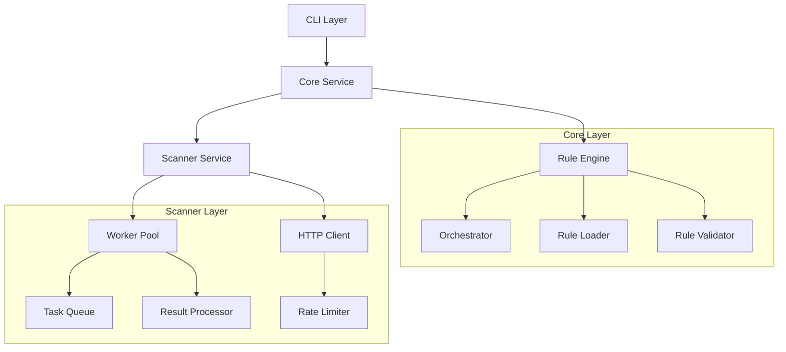

# Architecture Overview | Tổng Quan Kiến Trúc

## System Components | Thành Phần Hệ Thống

## Component Details | Chi Tiết Thành Phần

### 1. CLI Layer | Lớp CLI
- Command line interface | Giao diện dòng lệnh
- Configuration management | Quản lý cấu hình
- Result presentation | Hiển thị kết quả

### 2. Core Service | Dịch Vụ Core
- Business logic orchestration | Điều phối logic nghiệp vụ
- Task scheduling | Lập lịch tác vụ
- Result aggregation | Tổng hợp kết quả

### 3. Scanner Service | Dịch Vụ Scanner
- HTTP request handling | Xử lý request HTTP
- Worker pool management | Quản lý worker pool
- Evidence collection | Thu thập bằng chứng

### 4. Rule Engine | Rule Engine
- Rule loading & validation | Tải và xác thực rule
- Pattern matching | So khớp mẫu
- Finding generation | Tạo kết quả phát hiện

## Communication Flow | Luồng Giao Tiếp

### gRPC Services | Dịch Vụ gRPC
1. ScannerService
   - ExecuteScan
   - StreamResults
   - GetTaskStatus
   - Heartbeat

### Data Flow | Luồng Dữ Liệu
1. CLI → Core
   - Scan requests | Yêu cầu quét
   - Configuration | Cấu hình
   - Control commands | Lệnh điều khiển

2. Core → Scanner
   - Task distribution | Phân phối tác vụ
   - Rule updates | Cập nhật rule
   - Status monitoring | Giám sát trạng thái

3. Scanner → Core
   - Scan results | Kết quả quét
   - Task status | Trạng thái tác vụ
   - Resource metrics | Số liệu tài nguyên

## Design Principles | Nguyên Tắc Thiết Kế

### 1. Modularity | Tính Modul
- Loose coupling | Liên kết lỏng lẻo
- High cohesion | Tính gắn kết cao
- Plugin architecture | Kiến trúc plugin

### 2. Scalability | Khả Năng Mở Rộng
- Horizontal scaling | Mở rộng theo chiều ngang
- Load balancing | Cân bằng tải
- Resource optimization | Tối ưu tài nguyên

### 3. Reliability | Độ Tin Cậy
- Fault tolerance | Chịu lỗi
- Data consistency | Tính nhất quán dữ liệu
- Error handling | Xử lý lỗi